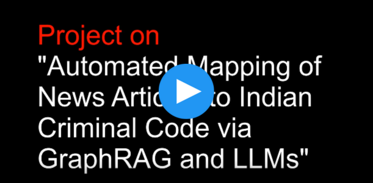

# Legal RAG on Bharatiya Nyaya Sanhita (BNS) with Neo4j and LLMs

This project implements a sophisticated Retrieval-Augmented Generation (RAG) system to answer legal questions about the **Bharatiya Nyaya Sanhita (BNS)**. It parses the BNS PDF, automatically extracts legal concepts into a Neo4j knowledge graph, and uses a Large Language Model (LLM) to provide structured answers based on user queries.

## 📜 Overview

The core challenge with legal documents is their dense, unstructured nature. This project tackles that by creating a structured, queryable knowledge base from the BNS text. When a user asks a question (e.g., by describing a scenario from a news article), the system intelligently finds the most relevant legal offense and provides a detailed, cited answer.

## ⚙️ How It Works

The system follows a two-phase process: **1. Indexing** and **2. Querying**.

### 1. Indexing Pipeline (One-time Setup)

1.  **PDF Loading & Chunking**: The `BNS.pdf` document is loaded and split into smaller, manageable text chunks using `langchain`.
2.  **Knowledge Extraction**: A powerful LLM (via the Groq API) reads through the text chunks and extracts key legal information into structured tuples of `(offence, chapter, section, punishment_clause)`.
3.  **Knowledge Graph Construction**: These structured tuples are used to populate a **Neo4j graph database**. Each offense, chapter, section, and punishment becomes a node, with relationships connecting them (e.g., `Offense -[:refersToSection]-> Section`).

### 2. Querying Pipeline (Real-time)

1.  **Semantic Search**: When a user enters a query, a `sentence-transformer` model converts it into a vector embedding. This embedding is used to find the most semantically similar `Offense` node in the Neo4j graph.
2.  **Context Retrieval**: Once the most relevant offense is identified, the system queries the Neo4j graph to retrieve all connected information (the chapter, section, and punishment details). This retrieved data serves as the "context".
3.  **Answer Generation**: The context and the original query are passed to the LLM with a carefully crafted prompt. The LLM then generates a final, human-readable, and structured legal explanation based *only* on the retrieved context.
4.  **Interactive UI**: web interface, which shows the final answer and the step-by-step processing logs.

## ✨ Features

-   **Automated Knowledge Extraction**: Automatically parses and structures complex legal text.
-   **Knowledge Graph Representation**: Models legal information in a highly connected and queryable Neo4j graph.
-   **Semantic Querying**: Understands the user's intent, not just keywords, to find relevant laws.
-   **Context-Aware Generation**: Generates answers grounded in the retrieved legal text, reducing hallucinations.
-   **Interactive Interface**: Simple and intuitive UI for easy interaction, complete with "under-the-hood" logs.

## 🛠️ Tech Stack

-   **LLM Orchestration**: LangChain
-   **LLM Inference**: Groq (for fast API access to models like Llama 3, Mixtral, etc.)
-   **Knowledge Graph**: Neo4j
-   **PDF Processing**: `PyPDFLoader`
-   **Semantic Search**: `sentence-transformers`
  
## 💡 Future Improvements

- **Accuracy Optimization**: Enhance retrieval and reasoning precision by refining graph queries, embeddings, and prompt structure.

- **Highlight Graph Context**: Visually display the subgraph of retrieved legal nodes and relationships to help users verify and trust the source.

- **Feedback Loop**: Allow users to rate responses or suggest corrections, enabling continuous refinement of both graph queries and LLM behavior.

